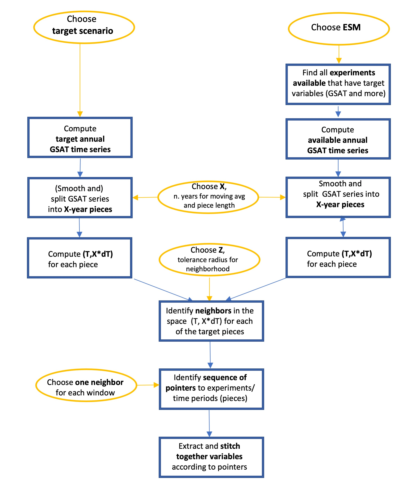
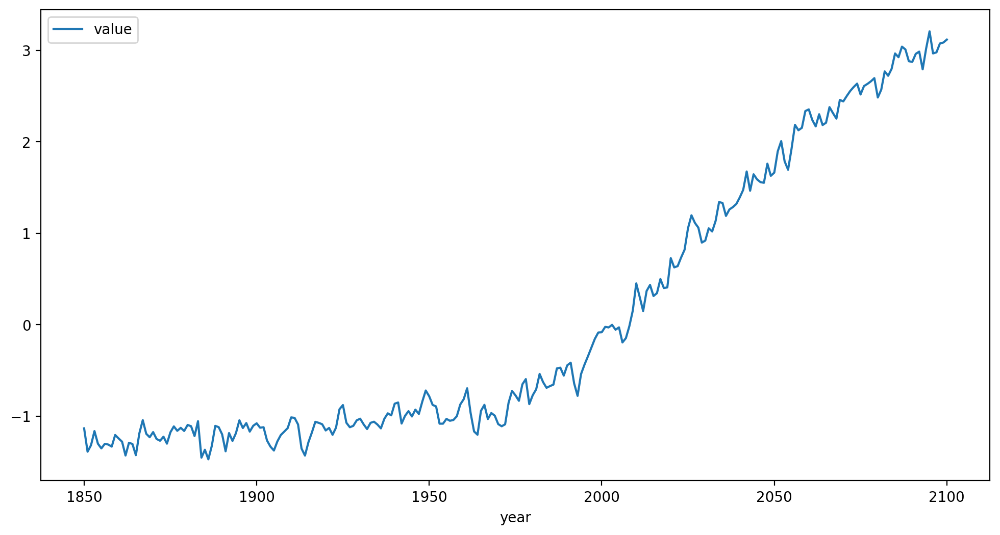
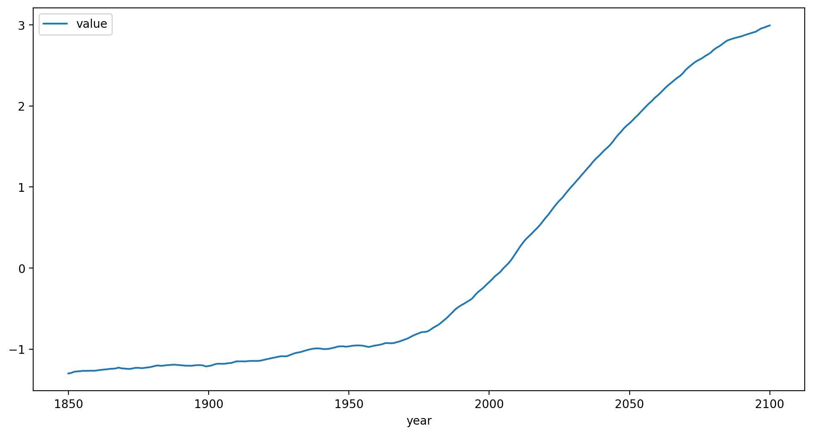
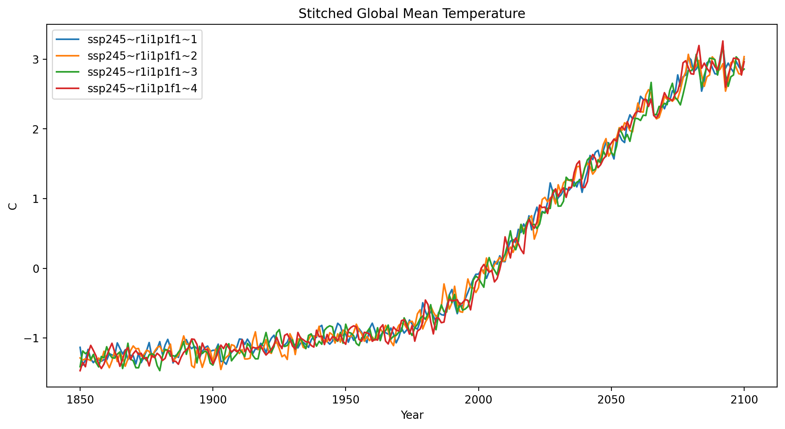
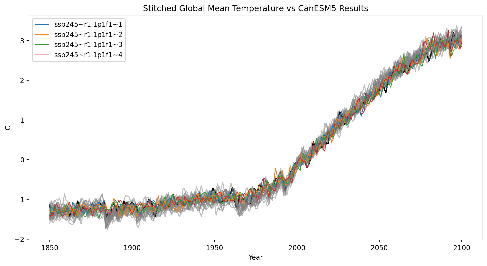
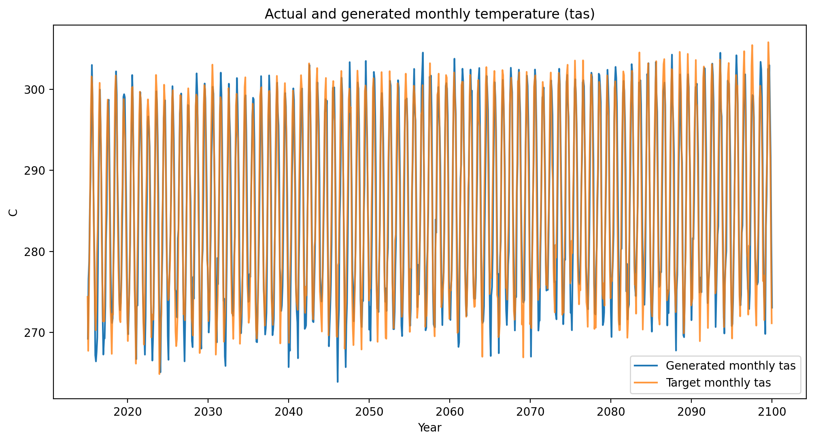
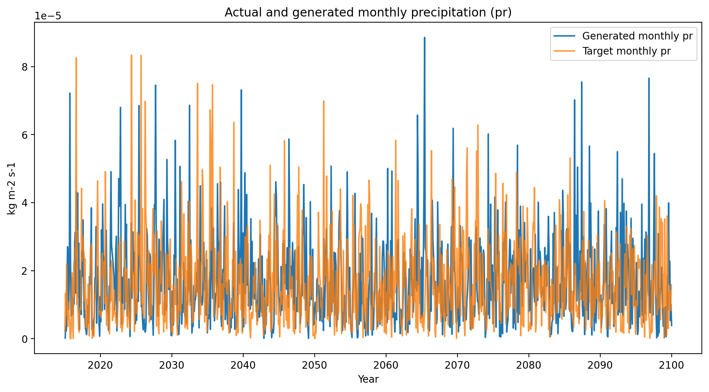

Quickstarter
=============

The purpose of this tutorial is to demonstrate how ``stitches`` can be
used as an emulator. While ``stitches`` can emulate a number of CMIP6
models this example will focus on emulating CanESM5 SSP245 results.

To use ``stitches``, there are a number of decisions users have to make,
perhaps the most important being:

-  Which ESM will ``stitches`` emulate?
-  What archive data will be used? These are values that the target data
   will be matched to. It should only contain data for the specific ESM
   that is being emulated. Users may limit the number of experiments or
   ensemble realizations within the archive in order to achieve their
   specific experimental setup.
-  What target data will be used? This data frame represents the
   temperature pathway the stitched product will follow. The contents of
   this data frame may come from CMIP6 ESM results for an SSP or it may
   follow some arbitrary pathway.

A diagram illustrating the ``stitches`` process is included for
reference:

   stitches workflow

-  ``stitches`` defaults to :math:`X=9` year windows.

Getting Started
---------------

Start by loading the stitches package (see `installation
instructions <https://github.com/jgcri/stitches>`__ if ``stitches`` is
not yet installed).

.. code:: ipython3

    import stitches

Load the additional python libraries that will be used in this example.
These packages are installed as ``stitches`` dependencies.

.. code:: ipython3

    import os
    import pkg_resources
    import warnings

    import numpy as np
    import pandas as pd
    from matplotlib import pyplot as plt

    # For help with plotting
    %matplotlib inline
    %config InlineBackend.figure_format = 'retina'
    plt.rcParams['figure.figsize'] = 12, 6

Install the package data from Zenodo
------------------------------------

The package data is all data that has been processed from raw Pangeo
data and is generated with package functions. For convenience and rapid
cloning of the github repository, the package data is also minted on
Zenodo and can be quickly downloaded for using the package.

.. code:: ipython3

    stitches.install_package_data()

Example 1: Emulate global mean air temperature
----------------------------------------------

We will begin with an example focused on emulating global mean air
temperature before moving on to an example producing gridded data for
multiple variables.

The global mean air temperature (GSAT) is the key variable upon which
``stitches`` operates to construct new realizations, with the added
benefit that it is easy to visualize.

Example Set Up
~~~~~~~~~~~~~~

In this example, we will use ``stitches`` to emulate CanESM5 SSP245
results. Then we will compare the ``stitches`` results with actual CMIP6
CanESM5 SSP245 output data.

Decide on the archive data
^^^^^^^^^^^^^^^^^^^^^^^^^^

-  Limit the archive matching data to the model we are trying to
   emulate, CanESM5 in this case.
-  In this example, we treat SSP245 as a novel scenario rather than one
   run by the ESM and available, so we exclude it from the archive data.
-  The internal package data called ``matching_archive`` contains the
   temperature results for all the ESMs-Scenarios-ensemble members that
   are available for ``stitches`` to use in its matching process. In
   this file monthly, tas output has been processed to mean temperature
   anomaly and the temperature change over a window of time. By default
   ``stitches`` uses a 9-year window.

.. code:: ipython3

    # read in the package data of all ESMs-Scenarios-ensemble members avail.
    data_directory = pkg_resources.resource_filename('stitches', "data")
    path = os.path.join(data_directory, 'matching_archive.csv')
    data = pd.read_csv(path)

    archive_data = data.loc[(data["experiment"].isin(['ssp126',  'ssp370', 'ssp585']))
                           & (data["model"] == "CanESM5")].copy()

Modify Inputs - Decide on the target data
^^^^^^^^^^^^^^^^^^^^^^^^^^^^^^^^^^^^^^^^^

-  The primary input to ``stitches`` functions that most users will
   adjust is the target data.

-  The target data is the temperature pathway the stitched (emulated)
   product will follow. This data can come from an ESM or another class
   of climate models, for a specific SSP scenario or an arbitrarily
   defined scenario. Similarly to the archive data, the target data
   should contain the mean temperature anomaly and rate of temperature
   change over a window of time. The target data window and the archive
   window must be the same length, ``stitches`` uses a 9-year window by
   default.

-  In this example because we are demonstrating ``stitches`` ability to
   emulate CanESM5 SSP245, we will use CanESM5 SSP245 results for a
   single ensemble member to use as our target data.

.. code:: ipython3

    # Load time series and subset to target time series if needed:
    targ = pd.read_csv(os.path.join(data_directory, "tas-data", "CanESM5_tas.csv"))
    target_data = targ.loc[(targ["model"] == "CanESM5")
                           & (targ["experiment"] == 'ssp245')].copy()

    target_data  = target_data[target_data["ensemble"].isin(['r1i1p1f1'])].copy()

    target_data = target_data.drop(columns='zstore').reset_index(drop=True)

Take a look at the structure and a plot of the time series we will be
targeting:

.. code:: ipython3

    print(target_data.head())
    target_data.plot(x='year', y='value')
    plt.show()
    plt.close()

.. parsed-literal::

      variable experiment  ensemble    model  year     value
    0      tas     ssp245  r1i1p1f1  CanESM5  1850 -1.133884
    1      tas     ssp245  r1i1p1f1  CanESM5  1851 -1.389375
    2      tas     ssp245  r1i1p1f1  CanESM5  1852 -1.318175
    3      tas     ssp245  r1i1p1f1  CanESM5  1853 -1.163771
    4      tas     ssp245  r1i1p1f1  CanESM5  1854 -1.302066

-  Any time series of global average temperature anomalies can be used
   as a target. However, the data frame containing this time series must
   be structured as above: a ``variable`` column containing entries of
   ‘tas’, ``year`` and ``value`` columns containing the data, and
   ``experiment``, ``ensemble``, ``model`` columns with identifying
   information of the source of this target data.

-  The actual entries in the ``experiment``, ``ensemble``, ``model``
   columns are only used for generating identifying strings for
   generated ensemble members.

-  In this demonstration, we will specifically be targeting ensemble
   member 1 of the CanESM5 SSP245 simulations. The entire SSP245
   ensemble may be jointly targeted by omitting the line
   ``target_data  = target_data[target_data["ensemble"].isin(['r1i1p1f1'])].copy()``

Modify Inputs - Prepare target data for matching
^^^^^^^^^^^^^^^^^^^^^^^^^^^^^^^^^^^^^^^^^^^^^^^^

``stitches`` includes functions that convert the above data frame of raw
target data into correctly structured target data for matching.

.. code:: ipython3

    # First, smooth the target data
    target_data = stitches.fx_processing.calculate_rolling_mean(target_data,
                                                                size=31).copy()
    target_data.plot(x='year', y='value')
    plt.show()
    plt.close()

    # then process so it can be matched on:
    target_data = stitches.fx_processing.get_chunk_info(
        stitches.fx_processing.chunk_ts(df = target_data,  n=9)).copy()

Use the target_data and archive_data to make the recipes using the function ``make_recipe()``
^^^^^^^^^^^^^^^^^^^^^^^^^^^^^^^^^^^^^^^^^^^^^^^^^^^^^^^^^^^^^^^^^^^^^^^^^^^^^^^^^^^^^^^^^^^^^

-  We ask for 4 new realizations to be constructed, and we specify that
   the matching be limited to a ``tol`` (:math:`Z` in the diagram) value
   of 0.06degC.

-  ``tol`` is the parameter that effectively controls both the maximum
   number of generated time series that may be constructed and the
   quality of matches.

-  For large values of ``tol``, the matches constructed may be no good.
   Currently, the cutoff values of ``tol`` for each ESM are determined
   by post-hoc calculation, as described in the ESD paper.

-  we use the ``reproducible`` argument so that the results are
   reproducible. It is not required and can be set to ``False`` to have
   a random draw of generated recipes

.. code:: ipython3

    my_recipes = stitches.make_recipe(target_data,
                                      archive_data,
                                      tol=0.06,
                                      N_matches=4,
                                      reproducible=True)

Now use the recipe to get the global mean air temperature using
``gmat_stitching``. The data frame returned by ``gmat_stitching`` will
contain the final stitched product.

.. code:: ipython3

    stitched_global_temp = stitches.gmat_stitching(my_recipes)

Visualize Results
^^^^^^^^^^^^^^^^^

.. code:: ipython3

    groups = stitched_global_temp.groupby('stitching_id')

    for name, group in groups:
        plt.plot(group.year, group.value, label = name)

    plt.xlabel("Year")
    plt.ylabel("C")
    plt.title("Stitched Global Mean Temperature")
    plt.legend()
    plt.show()
    plt.close()

Now let’s compare the stitched products with the actual CanESM5 SSP245 data
^^^^^^^^^^^^^^^^^^^^^^^^^^^^^^^^^^^^^^^^^^^^^^^^^^^^^^^^^^^^^^^^^^^^^^^^^^^

-  The black curve is realization 1 - the ESM data that this notebook
   actually targeted.
-  The gray curves are the other archived realizations of SSP245 for
   CanESM5 to illustrate that the generated ensemble members do not
   systematically depart from the actual ensemble behavior.
-  GSAT data is included as package data in ``stitches`` for
   convenience.

.. code:: ipython3

    # Load the comparison GSAT data
    data_path = pkg_resources.resource_filename('stitches', 'data/tas-data/CanESM5_tas.csv')

    comp_data = pd.read_csv(data_path)
    comp_data = comp_data.loc[comp_data["experiment"] == "ssp245"]

.. code:: ipython3

    # full ensemble of actual ESM runs:
    groups = comp_data.groupby('ensemble')
    for name, group in groups:
        if(group.ensemble.unique() == 'r1i1p1f1'):
            plt.plot(group.year, group.value, color = "black", linewidth = 2.0)
        else:
            plt.plot(group.year, group.value, color = "0.5", alpha=0.5)

    # The stitched realizations:
    groups = stitched_global_temp.groupby('stitching_id')
    for name, group in groups:
        plt.plot(group.year, group.value, linewidth= 1.0, label = name)

    plt.legend()
    plt.xlabel("Year")
    plt.ylabel("C")
    plt.title("Stitched Global Mean Temperature vs CanESM5 Results")
    plt.show()
    plt.close()

Example 2: stitching gridded products for multiple variables.
-------------------------------------------------------------

With the basis of matching illustrated in the example 1, we highlight
especially the structure of the “recipes” ``stitches`` creates:

.. code:: ipython3

    print(my_recipes.iloc[0,])

.. parsed-literal::

    target_start_yr                                                    1850
    target_end_yr                                                      1858
    archive_experiment                                           historical
    archive_variable                                                    tas
    archive_model                                                   CanESM5
    archive_ensemble                                               r1i1p1f1
    stitching_id                                          ssp245~r1i1p1f1~1
    archive_start_yr                                                   1850
    archive_end_yr                                                     1858
    tas_file              gs://cmip6/CMIP6/CMIP/CCCma/CanESM5/historical...
    Name: 0, dtype: object

The ``tas_file`` entry points to the specific CMIP6 netcdf file on
pangeo that must be pulled for these years to create a gridded
temperature product. To create a recipe that can produce a gridded
product for multiple variables we will need to use
``stitches.make_recipe()`` with the argument ``non_tas_variables`` set
to the additional variables of interest.

Match and stitch
~~~~~~~~~~~~~~~~

As in example 1 set up the target and archive data. We will be using the
same setup for CanESM5 ssp245.

-  Set the ``non_tas_variables`` = “pr” to indicate that the recipe
   should include precipitation results (see
   ``help(stitches.make_recipe)`` for more details on
   ``non_tas_variables`` ). Now the resulting recipe includes
   ``tas_file`` and ``pr_file``\ columns that point to CMIP6 files for
   ``tas`` and ``pr`` monthly data on pangeo. These files will be pulled
   from pangeo and data for these years will be used to create the
   gridded data product.
-  Variables other than surface air temperature and precipitation may be
   considered.
-  In this example we will only generate a recipe for one new
   realization for expediency, but ``N_matches`` may be increased with
   no changes to the stitching calls below.

.. code:: ipython3

    my_recipes = stitches.make_recipe(target_data,
                                      archive_data,
                                      tol=0.06,
                                      non_tas_variables=['pr'],
                                      N_matches=1,
                                      reproducible=True)

To stitch new realizations of the gridded data as netcdfs, use the
function ``gridded_stitching``. The results are saved in a
user-specified directory. In this example, it is the same directory this
notebook sits in.

These netcdf files may then be read in and examined with ``xarray``
functions.

For speed, this block is not executed by default in the quickstart.
Instead, we have pre-built and uploaded these netcdfs for easy
exploration.

::

   stitches.gridded_stitching(out_dir='.',  rp=my_recipes)

Load generated data
~~~~~~~~~~~~~~~~~~~

.. code:: ipython3

    # load the stitched (generated) temperature (tas) netcdf files
    gen_tas = stitches.fetch_quickstarter_data(variable="tas")

    # load the stitched pr netcdf file
    gen_pr = stitches.fetch_quickstarter_data(variable="pr")

Fetch target data from pangeo for comparison
~~~~~~~~~~~~~~~~~~~~~~~~~~~~~~~~~~~~~~~~~~~~

.. code:: ipython3

    # Fetch the actual data directly from pangeo
    pangeo_path = pkg_resources.resource_filename('stitches', 'data/pangeo_table.csv')

    pangeo_data = pd.read_csv(pangeo_path)

    pangeo_data = pangeo_data.loc[(pangeo_data['variable'].isin(['tas', 'pr']))
                                  & (pangeo_data['domain'].str.contains('mon'))
                                  & (pangeo_data['experiment'].isin(['ssp245']))
                                  & (pangeo_data['ensemble'].isin(['r1i1p1f1']))
                                  & (pangeo_data['model'].isin(['CanESM5']))].copy()

    pangeo_data

.. raw:: html

    

    
    <table border="1" class="dataframe">
      <thead>
        <tr style="text-align: right;">
          <th></th>
          <th>model</th>
          <th>experiment</th>
          <th>ensemble</th>
          <th>variable</th>
          <th>zstore</th>
          <th>domain</th>
        </tr>
      </thead>
      <tbody>
        <tr>
          <th>21843</th>
          <td>CanESM5</td>
          <td>ssp245</td>
          <td>r1i1p1f1</td>
          <td>pr</td>
          <td>gs://cmip6/CMIP6/ScenarioMIP/CCCma/CanESM5/ssp...</td>
          <td>Amon</td>
        </tr>
        <tr>
          <th>21910</th>
          <td>CanESM5</td>
          <td>ssp245</td>
          <td>r1i1p1f1</td>
          <td>tas</td>
          <td>gs://cmip6/CMIP6/ScenarioMIP/CCCma/CanESM5/ssp...</td>
          <td>Amon</td>
        </tr>
      </tbody>
    </table>
    

.. code:: ipython3

    # load the target tas netcdf files
    tas_address = pangeo_data.loc[pangeo_data['variable']== 'tas'].zstore.copy()
    tar_tas = stitches.fetch_nc(tas_address.values[0])

    # load the target pr netcdf files
    pr_address = pangeo_data.loc[pangeo_data['variable']== 'pr'].zstore.copy()
    tar_pr = stitches.fetch_nc(pr_address.values[0])

Visualize
~~~~~~~~~

Select a grid cell and plot the generated and target tas, pr data for
first-cut comparison

.. code:: ipython3

    def plot_comparison(generated_data,
                        target_data,
                        variable,
                        alpha=0.8):
        """Plot comparision between target variable time series and generated data"""

        if variable.casefold() == "pr":
            variable_name = "precipitation"
            units = "kg m-2 s-1"
        else:
            variable_name = "temperature"
            units = "C"

        # temperature (tas)
        plt.plot(generated_data.time,
                 generated_data[variable],
                 label=f"Generated monthly {variable}")

        with warnings.catch_warnings():
            warnings.filterwarnings("ignore")

            plt.plot(target_data.indexes['time'].to_datetimeindex(),
                     target_data[variable],
                     alpha=alpha,
                     label = f"Target monthly {variable}")

        plt.legend()
        plt.xlabel("Year")
        plt.ylabel(units)
        plt.title(f"Actual and generated monthly {variable_name} ({variable})")
        plt.show()
        plt.close()

.. code:: ipython3

    # lon and lat values for a grid cell near the Joint Global Change Research Institute in College Park, MD, USA
    cp_lat = 38.9897
    cp_lon = 180 + 76.9378

    # lat and lon coordinates closest
    abslat = np.abs(gen_tas.lat - cp_lat)
    abslon = np.abs(gen_tas.lon-cp_lon)
    c = np.maximum(abslon, abslat)
    ([lon_loc], [lat_loc]) = np.where(c == np.min(c))
    lon_grid = gen_tas.lon[lon_loc]
    lat_grid = gen_tas.lat[lat_loc]

    cp_tas_gen = gen_tas.sel(lon=lon_grid,
                             lat=lat_grid,
                             time=slice('2015-01-01', '2099-12-31')).copy()

    cp_tas_tar = tar_tas.sel(lon=lon_grid,
                             lat=lat_grid,
                             time=slice('2015-01-01', '2099-12-31')).copy()

    cp_pr_gen = gen_pr.sel(lon=lon_grid,
                           lat=lat_grid,
                           time=slice('2015-01-01', '2099-12-31')).copy()

    cp_pr_tar = tar_pr.sel(lon=lon_grid,
                           lat=lat_grid,
                           time=slice('2015-01-01', '2099-12-31')).copy()

    # temperature (tas)
    plot_comparison(generated_data=cp_tas_gen,
                    target_data=cp_tas_tar,
                    variable="tas")

    # precipitation (pr)
    plot_comparison(generated_data=cp_pr_gen,
                    target_data=cp_pr_tar,
                    variable="pr")

Visual validation of the complex spatial, temporal, and cross-variable
relationships present in ESM outputs is not possible. We extensively
validate that the method reproduces ESM internal variability in the ESD
paper, but this visual plotting at least suggests that nothing is
obviously wrong.

In other words, it’s not inconceivable from these plots that the orange
time series were sampled from the same underlying multivariate
distribution that generated the blue time series.
