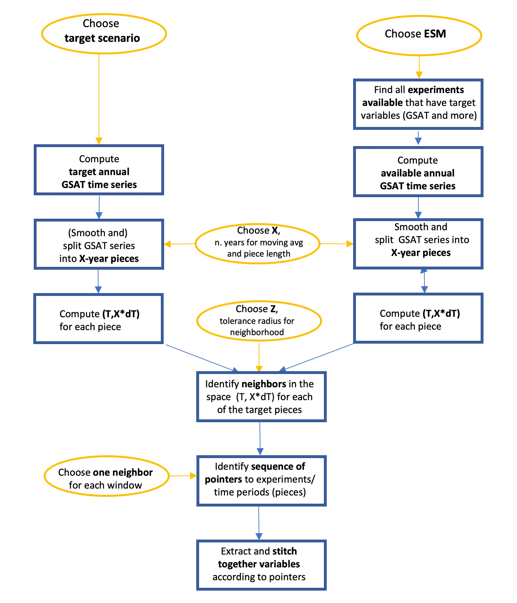

Welcome to **stitches**!
--------------------------------

**stitches** is a python-based framework that provides users with a way to easily interact with Pangeo-hosted CMIP6 data to emulate the output variables of a target Earth System Model (ESM). Figure 1 demonstrates the **stitches** workflow.

To use **stitches**, there are a number of decisions users have to make, perhaps the most important being:

* Which **ESM** will **stitches** emulate?
* What **scenario** will be the target of the emulation?
* Which available CMIP6 **experiments**, from the ESM to be emulated, will constitute the archive, i.e., the building blocks that stitches will use to construct the target scenario?

**stitches** works by connecting together short segments of existing ESM simulations, relying on the fact that most variables are not path dependent, i.e., have short memory. It works by matching existing pieces (9-year windows in our specific implementation) of global average temperature trajectories from different experiments available, to the target scenario’s global temperature trajectory, which has been divided up into pieces of the same length. Once the sequence of time windows-experiments in the archive  is identified that matches the target, any variable in the ESM output available for those time windows-experiments whose evolution is not path dependent can be extracted and stitched together according to the same sequence.

Why do we need **stitches**?
--------------------------------

Impact research often requires many output variables from ESMs, including but not limited to global gridded temperature, precipitation, sea level pressure, relative humidity, and more. Impact research also often requires these values on a monthly or even daily time scale. 

ESMs are expensive to run, often limiting the scenarios that can be explored and the number of ensemble members that can be generated for each scenario. **stitches** intelligently recombines the existing model runs available from ESMs in CMIP6 into global, gridded, multivariate outputs for *novel scenarios* (e.g., using a simple model to translate new forcing pathways into a global temperature trajectory that becomes stitches target).  on monthly or daily timescales. **stitches** can also be used to enrich the ensemble sizes of existing scenarios. The resulting generated gridded multivariate outputs preserve the ensemble statistics of the ESM's data. If the ESM has saved it, **stitches** can emulate the ESM output at any frequency: monthly, daily or even higher.

References
---------------------------

Tebaldi et al. "STITCHES: creating new scenarios of climate model output by stitching together pieces of existing simulations"
*Earth System Dynamics* , 2022.
https://doi.org/10.5194/esd-13-1557-2022

Documentation
--------------------------

.. toctree::
   :maxdepth: 1
   :caption: Getting Started

   getting-started/installation
   getting-started/quickstarter
   getting-started/tutorial

.. toctree::
   :maxdepth: 1
   :caption: User Guides

   examples/modify-inputs

.. toctree::
   :maxdepth: 1
   :caption: Python API

   reference/api

.. toctree::
   :maxdepth: 1
   :caption: Contributing

   reference/contributing
