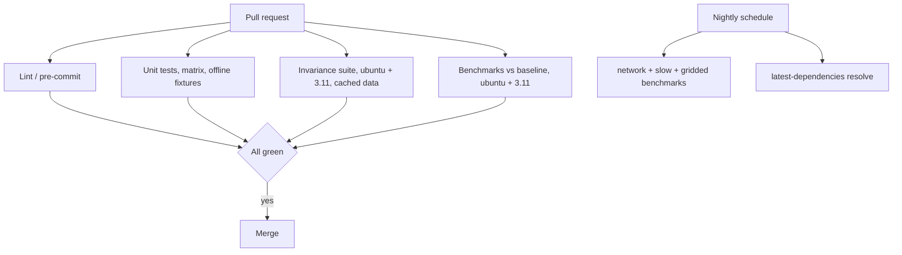

# Benchmarks and Output-Invariance Regression Testing

> **Implementation status.** The harness described here is implemented and green.
> See [§0](#0-implemented-baseline-2026-08-28) for the recorded baseline and the
> scaling findings it produced.

---

## 0. Implemented baseline (2026-08-28)

Environment: macOS, Python 3.13.3, pandas 2.2.3 → verified also under pandas
3.0.5 / NumPy 2.5.2 / scikit-learn 1.9.0.

Suite state:

```
tests/            98 passed, 13 skipped (network/package_data), ~8s
tests/regression/ 70 golden-output tests, 34 artifacts, 384K
benchmarks/       33 benchmarks, ~39s, saved as 0001_baseline.json
```

### 0.1 Bugs found by adding the suite

Writing the regression tests immediately surfaced two crashes that make the
package unusable on a current scientific Python stack. Both are recorded in
[`CHANGELOG.md`](../CHANGELOG.md):

| Function | Failure | Cause |
|---|---|---|
| `get_chunk_info` | `TypeError: only 0-dimensional arrays can be converted to Python scalars` | `float()` on the one-element array `model.coef_[0]`; removed in NumPy 2 |
| `calculate_rolling_mean` | `ValueError: Cannot specify both 'axis' and 'index'/'columns'` | `drop(columns="value", axis=1)` passes both selectors; rejected by pandas 3 |

This is the argument for building the suite first: neither bug was visible from
the existing tests.

### 0.2 Baseline timings (mean, sorted)

Slowest twelve, which is where optimization effort belongs:

| Mean | Benchmark |
|---:|---|
| 646.5 ms | `match_neighborhood_scaling[280]` |
| 234.7 ms | `match_neighborhood_scaling[112]` |
| 82.8 ms | `match_neighborhood_archive_width[16]` |
| 78.7 ms | `permute_by_tolerance[0.3]` |
| 67.4 ms | `match_neighborhood_archive_width[8]` |
| 59.5 ms | `match_neighborhood_scaling[28]` |
| 58.1 ms | `match_neighborhood_example[0.1]` |
| 50.6 ms | `permute_by_tolerance[0.1]` |
| 49.3 ms | `permute_stitching_recipes[5]` |
| 49.3 ms | `permute_stitching_recipes[2]` |
| 45.2 ms | `calculate_rolling_mean_scaling[100]` |
| 27.6 ms | `permute_by_tolerance[0.05]` |

### 0.3 Scaling findings

These are the conclusions the parametrization was designed to produce.

**`match_neighborhood` is superlinear in target windows — the top optimization target.**

| Target windows | Mean | Factor vs. 28 |
|---:|---:|---:|
| 28 | 59.5 ms | 1.0× |
| 112 (4×) | 234.7 ms | 3.9× |
| 280 (10×) | 646.5 ms | **10.9×** |

Growth is slightly worse than linear (10.9× cost for 10× input). Combined with
its already-dominant absolute cost, this makes the per-group Python loop in
[`stitches/fx_match.py`](../stitches/fx_match.py:150) the clear first target for
vectorization.

**Archive width costs less than target count.** Going from 2 to 16 ensemble
members (8×) raises cost only 1.6× (53.2 → 82.8 ms), so the bottleneck is
iterating target groups, not scanning the archive. Optimization should attack the
loop, not the search.

**`calculate_rolling_mean` is dominated by group count, not row count.**

| Groups | Mean | Per group |
|---:|---:|---:|
| 4 | 2.75 ms | 688 µs |
| 20 | 9.62 ms | 481 µs |
| 100 | 45.2 ms | 452 µs |

Roughly 450–700 µs of fixed overhead per group, and window size is irrelevant
(3/9/21 all ≈ 9.65 ms at 20 groups). That overhead is the `groupby.transform`
lambda, confirming it as a worthwhile target.

**`permute_stitching_recipes` saturates in `N_matches` but grows with tolerance.**
N=2 and N=5 are indistinguishable (49.28 vs 49.31 ms) because the synthetic
archive cannot support five collapse-free realizations, so the loop exits early.
Tolerance, by contrast, drives cost steadily (27.6 → 50.6 → 78.7 ms for
0.05/0.1/0.3) as more candidate rows flow through the constraint checks. A
realistic `N_matches` scaling benchmark needs a wider archive.

**`get_chunk_info` costs 20.1 ms for 28 chunks** — about 700 µs per chunk, spent
constructing a scikit-learn `LinearRegression` per chunk and growing the result
with repeated `pd.concat`. A closed-form slope would remove nearly all of it, and
the golden artifacts make that change safe to attempt.

### 0.4 Reproducing

```bash
python -m pytest tests -q                     # offline correctness, ~8s
python -m pytest tests/regression -q          # golden-output invariance
python -m pytest benchmarks --benchmark-only --benchmark-save=baseline
python -m pytest benchmarks --benchmark-only \
    --benchmark-compare=baseline --benchmark-compare-fail=mean:25%
```

---

Purpose: guarantee that modernization work described in [`plans/development-plan.md`](development-plan.md) does **not** alter scientific outputs, and that performance does not silently regress.

Two distinct suites:

| Suite | Question it answers | Gate |
|---|---|---|
| **Invariance / golden-output** | Did the numbers change? | Hard fail on any unexplained diff |
| **Performance benchmark** | Did it get slower or use more memory? | Fail beyond a configured threshold |

---

## 1. Baseline Capture

### 1.1 Freeze the reference point

```bash
git tag baseline/v0.13 <current-main-sha>
git push origin baseline/v0.13
```

Record an exact environment so the baseline is reproducible:

```bash
pip freeze > tests/regression/baseline-env-py311.txt
python -c "import platform,sys; print(platform.platform(), sys.version)" \
  >> tests/regression/baseline-env-py311.txt
```

### 1.2 Proposed layout

```
tests/
  regression/
    __init__.py
    conftest.py                 # tolerance config, golden dir resolution, --update-golden flag
    generate_golden.py          # CLI: rebuild golden artifacts from current code
    baseline-env-py311.txt
    golden/
      match/
        match_neighborhood_tol0.parquet
        match_neighborhood_tol0.1_nodup.parquet
        match_neighborhood_tol0.1_dedup.parquet
      recipe/
        permute_N1_seed1.parquet
        permute_N5_seed1.parquet
        make_recipe_ssp245_bcc.parquet
        generate_gridded_recipe_mon.parquet
      processing/
        rolling_mean_w9.parquet
        chunk_ts_n9.parquet
        get_chunk_info.parquet
      stitch/
        gmat_stitching_bcc.parquet
        gridded_stitching_bcc.sha256      # checksum only; NetCDF too large to vendor
      archive/
        make_matching_archive_w9.parquet.sha256
        tas_archive_filenames.json
    test_invariance_match.py
    test_invariance_recipe.py
    test_invariance_processing.py
    test_invariance_stitch.py
benchmarks/
  __init__.py
  conftest.py
  bench_match.py
  bench_recipe.py
  bench_processing.py
  bench_stitch.py
  bench_io.py
  asv.conf.json                 # optional: airspeed-velocity history tracking
```

Golden artifacts use **Parquet** (stable, typed, compact) rather than CSV to avoid float-formatting drift masking or creating diffs. Where an artifact would exceed ~1 MB, store a SHA-256 of a canonicalized serialization instead of the payload.

---

## 2. Invariance Suite

### 2.1 Functions that must be pinned

Ordered by risk. Everything reachable from [`stitches/__init__.py`](../stitches/__init__.py) is public API and must be covered.

| Target | Module | Determinism notes |
|---|---|---|
| `match_neighborhood` | [`stitches/fx_match.py`](../stitches/fx_match.py:235) | Deterministic; test `tol=0`, `tol=0.1`, both `drop_hist_duplicates` values |
| `internal_dist` | [`stitches/fx_match.py`](../stitches/fx_match.py:15) | Pure numeric |
| `drop_hist_false_duplicates` | [`stitches/fx_match.py`](../stitches/fx_match.py:95) | Tie-breaking on `min(idvalue)` is order-sensitive — pin explicitly |
| `shuffle_function` | [`stitches/fx_match.py`](../stitches/fx_match.py:81) | **Randomized** — must accept/lock a seed |
| `calculate_rolling_mean` | [`stitches/fx_processing.py`](../stitches/fx_processing.py:12) | `min_periods=1` edge behavior is the whole point; pin window ends |
| `chunk_ts`, `get_chunk_info` | [`stitches/fx_processing.py`](../stitches/fx_processing.py:63) | Deterministic |
| `subset_archive` | [`stitches/fx_processing.py`](../stitches/fx_processing.py:196) | Deterministic |
| `get_num_perms`, `remove_duplicates` | [`stitches/fx_recipe.py`](../stitches/fx_recipe.py:13) | Deterministic |
| `permute_stitching_recipes` | [`stitches/fx_recipe.py`](../stitches/fx_recipe.py:250) | **Randomized** via `group.sample(...)`; has a `testing=True` path that sets `random_state=1` — use it |
| `handle_transition_periods`, `handle_final_period` | [`stitches/fx_recipe.py`](../stitches/fx_recipe.py:678) | Deterministic |
| `generate_gridded_recipe`, `make_recipe` | [`stitches/fx_recipe.py`](../stitches/fx_recipe.py:931) | Depends on `pangeo_table.csv` — pin the data version |
| `gmat_stitching` | [`stitches/fx_stitch.py`](../stitches/fx_stitch.py:411) | Reads local `tas-data`; deterministic given data version |
| `gridded_stitching` | [`stitches/fx_stitch.py`](../stitches/fx_stitch.py:245) | Network (Pangeo) + writes NetCDF; mark `network`/`slow`, compare values not file bytes |
| `global_mean`, `get_ds_meta` | [`stitches/fx_data.py`](../stitches/fx_data.py:25) | Latitude-weighting math — pin against a synthetic grid |
| `calculate_anomaly`, `paste_historical_data` | [`stitches/make_tas_archive.py`](../stitches/make_tas_archive.py:104) | Deterministic; pin on a small synthetic frame |
| `make_matching_archive` | [`stitches/make_matching_archive.py`](../stitches/make_matching_archive.py:17) | Deterministic; checksum the output archive |
| `combine_df`, `anti_join`, `remove_obs_from_match`, `selstr` | [`stitches/fx_util.py`](../stitches/fx_util.py) | Cheap, fully deterministic — pure unit tests |

### 2.2 Handling nondeterminism

Two sources of randomness exist and both must be neutralized:

1. [`stitches/fx_recipe.py`](../stitches/fx_recipe.py:446) — `group.sample(1, replace=False)` vs. `random_state=1` under `testing=True`.
2. [`stitches/fx_match.py`](../stitches/fx_match.py:81) — `shuffle_function`.

Actions:

- Invariance tests always call with `testing=True` / an explicit seed.
- **Add a `seed: int | None = None` parameter** to the public randomized entry points (a strictly additive, backward-compatible change) so users can reproduce results, and so tests do not depend on a `testing` flag that also alters other behavior.
- Additionally assert **statistical** invariance for the unseeded path: run K=200 unseeded draws, compare the distribution of `dist_l2` and the set of selected archive points against the baseline using a fixed-tolerance comparison of summary statistics. This catches changes to the *sampling space* even when individual draws differ.

### 2.3 Comparison helpers

```python
# tests/regression/conftest.py  (sketch)
import pandas as pd
from pandas.testing import assert_frame_equal

# Sorting removes any dependence on groupby/concat ordering, which is exactly
# the kind of incidental change a refactor is allowed to make.
def canonicalize(df: pd.DataFrame) -> pd.DataFrame:
    df = df.reindex(sorted(df.columns), axis=1)
    return df.sort_values(list(df.columns), kind="mergesort").reset_index(drop=True)

def assert_matches_golden(actual, golden_path, rtol=0.0, atol=0.0):
    expected = pd.read_parquet(golden_path)
    assert_frame_equal(
        canonicalize(actual),
        canonicalize(expected),
        check_dtype=False,     # int64/int32 platform differences are acceptable
        check_like=False,
        rtol=rtol,
        atol=atol,
    )
```

Tolerance policy:

| Comparison | rtol / atol |
|---|---|
| Recipe tables, matches, chunk metadata (indices, years, labels) | exact (`0.0`) |
| Distances (`dist_l2`, `dist_dx`, `dist_fx`) | `rtol=1e-12` |
| Global-mean temperature values | `rtol=1e-10` |
| Gridded NetCDF field values | `rtol=1e-6`, `atol=1e-9` |

Rationale: anything integral or categorical must be bit-exact; floating-point reductions may legitimately reassociate across NumPy/pandas versions, so a tight-but-nonzero tolerance avoids false alarms while still catching real algorithmic change.

### 2.4 Test skeleton

```python
# tests/regression/test_invariance_match.py  (sketch)
import pandas as pd
import pytest
from stitches.fx_match import match_neighborhood
from .conftest import assert_matches_golden

@pytest.mark.parametrize(
    "tol,dedup,golden",
    [
        (0.0, True,  "match/match_neighborhood_tol0.parquet"),
        (0.1, False, "match/match_neighborhood_tol0.1_nodup.parquet"),
        (0.1, True,  "match/match_neighborhood_tol0.1_dedup.parquet"),
    ],
)
def test_match_neighborhood_invariant(golden_dir, tol, dedup, golden):
    target = pd.read_csv("tests/test-target_dat.csv")
    archive = pd.read_csv("tests/test-archive_dat.csv")
    out = match_neighborhood(target, archive, tol=tol, drop_hist_duplicates=dedup)
    assert_matches_golden(out, golden_dir / golden, rtol=1e-12)
```

### 2.5 Regenerating golden files

```bash
# Explicit, never automatic
python -m tests.regression.generate_golden --all
python -m tests.regression.generate_golden --only recipe
pytest tests/regression --update-golden     # equivalent, opt-in flag
```

Policy: a PR that changes any file under `tests/regression/golden/` **must** include a `CHANGELOG.md` entry under `### Changed — outputs` explaining which defect the new output corrects, and must be reviewed by a domain maintainer, not just a code reviewer.

### 2.6 Fixtures and the data dependency

`tests/conftest.py` currently calls `stitches.install_package_data()` in a session fixture, which downloads the entire Zenodo archive.

- Pin the expected data record explicitly (e.g. Zenodo `8367628`) and assert it, so an upstream data change cannot be mistaken for a code regression.
- Cache the download in CI keyed on the data version:

  ```yaml
  - uses: actions/cache@v4
    with:
      path: ~/.cache/stitches-data
      key: stitches-data-8367628
  ```

- Add an offline tier: small committed fixtures (the existing `tests/test-*.csv`) cover `fx_match`, `fx_processing`, `fx_recipe`, and `fx_util` invariance with no network at all. Only `gridded_stitching` and the Pangeo tests need the network.
- Existing test CSVs are duplicated in both [`tests/`](../tests/) and [`stitches/data/example/`](../stitches/data/example/) — consolidate to one location referenced by both.

---

## 3. Performance Benchmark Suite

### 3.1 Tooling

- `pytest-benchmark` for in-suite micro/meso benchmarks with JSON output and `--benchmark-compare-fail`.
- Optionally `asv` (airspeed velocity) for long-run history graphs across commits.
- `memory_profiler` / `tracemalloc` peak-RSS assertions for `gridded_stitching`, which is the memory-bound path.

### 3.2 What to benchmark

| Benchmark | Target | Why |
|---|---|---|
| `bench_match_neighborhood` | [`match_neighborhood`](../stitches/fx_match.py:235) at 1/10/50 target windows | Per-group Python loop, a WS-6 vectorization target |
| `bench_drop_hist_duplicates` | [`drop_hist_false_duplicates`](../stitches/fx_match.py:95) | Loop + `pd.concat` |
| `bench_permute_recipes` | [`permute_stitching_recipes`](../stitches/fx_recipe.py:250) at N=1/5/20 | Most algorithmically complex function in the package |
| `bench_make_recipe` | [`make_recipe`](../stitches/fx_recipe.py:1023) | End-to-end user path |
| `bench_rolling_mean` | [`calculate_rolling_mean`](../stitches/fx_processing.py:12) | `groupby.transform` with a lambda |
| `bench_chunk_ts` | [`chunk_ts`](../stitches/fx_processing.py:63) | Hot inner helper |
| `bench_matching_archive` | [`make_matching_archive`](../stitches/make_matching_archive.py:17) | Nested `for offset × groupby` loop |
| `bench_gmat_stitching` | [`gmat_stitching`](../stitches/fx_stitch.py:411) | Reads all `tas-data` CSVs |
| `bench_load_data_files` | [`load_data_files`](../stitches/fx_util.py:205) | CSV→Parquet migration candidate |
| `bench_pangeo_table_read` | [`fx_recipe.py`](../stitches/fx_recipe.py:980) repeated `read_csv` | Caching candidate |
| `bench_gridded_stitching` | [`gridded_stitching`](../stitches/fx_stitch.py:245) | `slow`+`network`; nightly only, tracks wall time and peak RSS |

### 3.3 Example

```python
# benchmarks/bench_match.py  (sketch)
import pandas as pd
import pytest
from stitches.fx_match import match_neighborhood

@pytest.fixture(scope="module")
def frames():
    return (
        pd.read_csv("tests/test-target_dat.csv"),
        pd.read_csv("tests/test-archive_dat.csv"),
    )

@pytest.mark.parametrize("tol", [0.0, 0.1, 0.5])
def test_bench_match_neighborhood(benchmark, frames, tol):
    target, archive = frames
    result = benchmark(match_neighborhood, target, archive, tol=tol)
    assert len(result) > 0
```

### 3.4 Thresholds and CI wiring

```bash
# Store the baseline once, on the tagged commit
pytest benchmarks --benchmark-only --benchmark-save=baseline

# On every PR
pytest benchmarks --benchmark-only \
  --benchmark-compare=baseline \
  --benchmark-compare-fail=mean:25%
```

- Fail a PR at **>25% mean regression** on any benchmark (generous, because GitHub runners are noisy).
- Run benchmarks on a **single fixed OS/Python combination** (ubuntu-latest / 3.11) to keep numbers comparable; never gate on the full matrix.
- Use `--benchmark-min-rounds` and warmup to reduce variance; treat sub-10ms benchmarks as informational only.
- Nightly scheduled job runs the `slow`/`network` benchmarks and posts results as an artifact.

### 3.5 Marker configuration

Add to `pyproject.toml`:

```toml
[tool.pytest.ini_options]
testpaths = ["tests"]
markers = [
  "network: requires internet access (Pangeo, Zenodo)",
  "slow: long-running (>30s)",
  "regression: golden-output invariance test",
  "benchmark: performance measurement, not correctness",
]
addopts = "-m 'not benchmark'"
```

This replaces the current `RUN = "ci"` class attributes in [`tests/test_stitch.py`](../tests/test_stitch.py:28) and [`tests/test_pangeo.py`](../tests/test_pangeo.py:17), which make tests *pass vacuously* (`self.assertEqual(0, 0)`) rather than skip visibly.

---

## 4. CI Integration



Jobs to add to [`.github/workflows/workflow.yml`](../.github/workflows/workflow.yml) (or split into separate workflows):

1. `test` — existing, upgraded to `actions/checkout@v4` / `setup-python@v5`, with `cache: pip`, filtered checkout, and coverage uploaded to Codecov.
2. `regression` — installs cached package data, runs `pytest tests/regression -m "regression and not network"`.
3. `benchmark` — runs `pytest benchmarks --benchmark-compare`, uploads the JSON artifact.
4. `nightly` — cron; network + slow + gridded, plus an unpinned dependency resolve to catch upstream breakage.

Add `concurrency: { group: ${{ github.ref }}, cancel-in-progress: true }` to stop stacked runs.

---

## 5. Implementation Order

1. Add pytest markers and delete the `RUN = "ci"` vacuous-pass pattern.
2. Add `tests/regression/` scaffolding, `canonicalize`/`assert_matches_golden`, and the `--update-golden` flag.
3. Add `seed` parameters to the randomized entry points (additive only, no behavior change when omitted).
4. Generate golden artifacts at `baseline/v0.13` and commit them.
5. Add `benchmarks/` and save the `baseline` benchmark run.
6. Wire the `regression` and `benchmark` CI jobs; require them on `main`.
7. Only then begin WS-2 onward from [`plans/development-plan.md`](development-plan.md).

## 6. Definition of Done

- Every function exported from [`stitches/__init__.py`](../stitches/__init__.py) has at least one invariance test.
- Zero vacuously-passing tests; all skips are marker-driven and reported in the summary.
- Golden files regenerate reproducibly from a clean checkout via one documented command.
- Benchmark baseline committed; PR comparison gate active.
- The regeneration policy (changelog entry + domain review) is documented in [`docs/source/reference/contributing.rst`](../docs/source/reference/contributing.rst).
