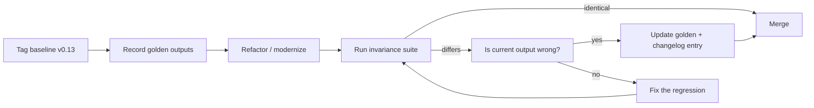
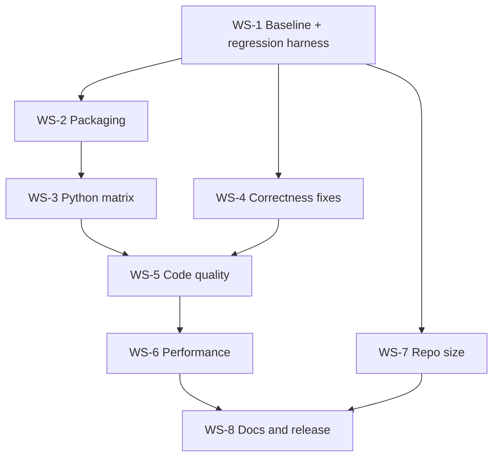

# `stitches` Development Plan

Status: draft for review
Scope: modernization, correctness, performance, repository hygiene, and regression protection for the `stitches-emulator` package (current version `0.13`).

Related documents:

- [`plans/repo-clone-performance.md`](repo-clone-performance.md) — why cloning is slow and how to fix it
- [`plans/benchmarks-and-regression-testing.md`](benchmarks-and-regression-testing.md) — output-invariance harness and performance benchmarks

---

## 1. Current State Assessment

### 1.1 Package layout

| Area | Observation |
|---|---|
| Build system | Legacy [`setup.py`](../setup.py) + near-empty [`setup.cfg`](../setup.cfg) + [`MANIFEST.in`](../MANIFEST.in); no `pyproject.toml`, no PEP 517/518 build backend |
| Version | [`stitches/_version.py`](../stitches/_version.py) pins `0.13`, hand-maintained and duplicated in [`stitches/install_pkgdata.py`](../stitches/install_pkgdata.py) URL map and in [`CITATION.cff`](../CITATION.cff) |
| Python support | `python_requires=">=3.9.0"`; CI matrix is 3.9–3.11 only. 3.9 is end-of-life; 3.12/3.13 untested |
| Dependencies | [`requirements.txt`](../requirements.txt) uses open-ended `>=` pins only; **`requests` is imported by [`stitches/install_pkgdata.py`](../stitches/install_pkgdata.py:11) but is not declared anywhere** |
| CI | [`.github/workflows/workflow.yml`](../.github/workflows/workflow.yml) uses `actions/checkout@v3` and `actions/setup-python@v4` (outdated), computes coverage but never uploads it, has no pip cache, no package-data cache, and no concurrency cancellation |
| Pre-commit | [`.pre-commit-config.yaml`](../.pre-commit-config.yaml) hooks are pinned to mid-2023 revisions (black 23.3.0, flake8 6.0.0, isort 5.12.0, pyupgrade v3.8.0). No `ruff`; three overlapping linters instead |
| Tests | 6 test modules, `unittest`-style, gated by hardcoded `RUN = "ci"` flags that silently skip real assertions; session fixture in [`tests/conftest.py`](../tests/conftest.py:16) downloads the full Zenodo archive on every run |
| Docs | Sphinx site present; API reference and quickstarter exist but reference an older workflow; no changelog |
| Data | All science data lives off-repo on Zenodo (record `8367628`) and is installed at runtime into `stitches/data/` |

### 1.2 Confirmed defects to fix (behavior-changing, currently incorrect)

These are bugs where "changing the output" is the *point*. Each needs a regression test written **before** the fix.

1. **`make_tas_archive` writes bad filenames / crashes.** In [`stitches/make_tas_archive.py`](../stitches/make_tas_archive.py:453):
   ```python
   for name, group in data.groupby(["model"]):
       path = tas_data_dir + "/" + name + "_tas.csv"
   ```
   - `tas_data_dir` is an `importlib.resources` `Traversable`, so `Traversable + str` raises `TypeError`.
   - With pandas ≥ 2.0, grouping by a **list** of one key yields a one-element **tuple** as `name`, so even after fixing the path join the filenames would become `('BCC-CSM2-MR',)_tas.csv`.
   - Fix: `os.path.join(str(tas_data_dir), f"{name}_tas.csv")` and `groupby("model")` (or unpack the tuple).
2. **Missing runtime dependency `requests`.** Fresh installs fail at `stitches.install_package_data()` unless `requests` happens to be present transitively.
3. **`install_pkgdata` robustness.** In [`stitches/install_pkgdata.py`](../stitches/install_pkgdata.py:53):
   - `os.mkdir` instead of `os.makedirs(..., exist_ok=True)`.
   - `requests.get(...)` has no `timeout`, no `raise_for_status()`, and buffers the entire (~GB-scale) zip into memory via `BytesIO`.
   - `tqdm` is imported but unused; the "progress" message is a bare `print`.
   - The version→URL dict must be manually extended for every release; a `DEFAULT_VERSION` fallback silently downloads a possibly mismatched dataset.
   - Only files whose path contains `tas-data` are re-nested; `temp-data` is created but never populated.
4. **Unused/dead imports and `# noqa`-adjacent lint debt** — flake8 is currently configured to ignore `F401`, masking real dead imports.
5. **Pandas/xarray/NumPy deprecation exposure** — grouped `.agg` with lambdas, `groupby(list_of_one)`, positional `dim` args to `xarray` reductions, and `intake-esm` pinned to a 2021 release. These will break under newer stacks even though outputs are currently correct.

### 1.3 Repository clone problem (summary)

The working tree is small; the **git history and binary blobs** are the cost. Primary suspects, in order of impact:

1. Jupyter notebooks committed **with base64-encoded PNG outputs** — [`notebooks/stitches-quickstart.ipynb`](../notebooks/stitches-quickstart.ipynb), [`notebooks/preparing-input-data.ipynb`](../notebooks/preparing-input-data.ipynb), [`notebooks/stitches_training_GCAMAnnualMeeting2023.ipynb`](../notebooks/stitches_training_GCAMAnnualMeeting2023.ipynb), [`notebooks/stitches_takehome_GCAMAnnualMeeting2023.ipynb`](../notebooks/stitches_takehome_GCAMAnnualMeeting2023.ipynb). Every re-run rewrites megabytes of unrelated base64, so **each historical commit stores a full new copy**.
2. Historical commits of package data (`stitches/data/tas-data/*.csv`, `*.nc`, `matching_archive*.csv`) that were later `.gitignore`d — ignoring a file does not remove it from history.
3. Duplicated raster assets (`stitches_diagram.jpg` stored three times under [`docs/source/getting-started/`](../docs/source/getting-started/), [`notebooks/figs/`](../notebooks/figs/), and [`paper/`](../paper/)) plus committed Sphinx `output_*.png` renders.

Full diagnosis and remediation options are in [`plans/repo-clone-performance.md`](repo-clone-performance.md).

---

## 2. Guiding Principle: Output Invariance

> Any refactor, dependency bump, or performance change must produce **bit-comparable or tolerance-comparable outputs** to the current release, except where the current output is provably wrong.

Enforcement mechanism:

1. Freeze "golden" outputs from the current code at a tagged baseline commit (`baseline/v0.13`).
2. Store golden artifacts as small, compressed fixtures (or checksums for large ones) under `tests/regression/`.
3. Every PR runs the invariance suite; deliberate output changes require updating the golden fixture **in the same PR** with a written justification in the changelog.



---

## 3. Workstreams

### WS-1 — Baseline and regression safety net (must land first)

- Tag `baseline/v0.13` and pin a fully resolved environment lockfile for reproducibility.
- Build the golden-output harness and performance benchmarks per [`plans/benchmarks-and-regression-testing.md`](benchmarks-and-regression-testing.md).
- Remove the `RUN = "ci"` escape hatches in [`tests/test_stitch.py`](../tests/test_stitch.py:28) and [`tests/test_pangeo.py`](../tests/test_pangeo.py:17); replace with `pytest` markers (`-m "not network"`, `-m "not slow"`) so skips are explicit and countable.
- Cache the Zenodo package data in CI so [`tests/conftest.py`](../tests/conftest.py) does not re-download per job.

### WS-2 — Packaging and build modernization

- Replace [`setup.py`](../setup.py)/[`setup.cfg`](../setup.cfg) with a PEP 621 `pyproject.toml` (setuptools backend), moving dependencies, `extras_require`, classifiers, and metadata inline.
- Single-source the version: keep `stitches/_version.py` as the authority (`dynamic = ["version"]`) or adop`setuptools-scm`; then derive `CITATION.cff` and docs `conf.py` from it.
- Declare `requests` as a runtime dependency; add upper bounds or a tested-versions matrix for `pandas`, `xarray`, `numpy`, `intake-esm`.
- Convert `MANIFEST.in` content to `[tool.setuptools.package-data]` where possible; verify wheel/sdist contents with `check-manifest` and `twine check`.
- Replace `twine~=3.4.1` dev pin with a current release; add a `build`+`twine` release workflow triggered on tags with PyPI Trusted Publishing.

### WS-3 — Python and dependency support matrix

- Drop Python 3.9; support 3.10–3.13. Update `pyupgrade`/`black`/`ruff` target versions accordingly.
- Expand the CI matrix to 3.10/3.11/3.12/3.13 on ubuntu + macos + windows, with a reduced "full matrix" on `main` and a fast subset on PRs.
- Add a scheduled weekly "latest dependencies" job (unpinned resolve) to catch upstream breakage early.

### WS-4 — Correctness fixes

- Fix the `make_tas_archive` filename/path bug (§1.2.1) with a unit test asserting produced filenames.
- Harden `install_pkgdata`: streaming download with `stream=True` + `tqdm`, `timeout`, `raise_for_status`, `os.makedirs(exist_ok=True)`, checksum verification, resume/skip-if-present, and an explicit error (not silent fallback) when a version has no registered dataset.
- Move the version→Zenodo-URL map out of code into a small data file (`stitches/data/zenodo_registry.json` or a `concept DOI` that always resolves to the latest record).
- Audit every `groupby([...])` call site for the pandas 2.x single-key-tuple behavior: [`fx_match.py`](../stitches/fx_match.py:150), [`fx_recipe.py`](../stitches/fx_recipe.py:514), [`make_matching_archive.py`](../stitches/make_matching_archive.py:60), [`make_tas_archive.py`](../stitches/make_tas_archive.py:453).
- Replace `print` diagnostics throughout with the `logging` module and a package-level logger.

### WS-5 — Code quality and structure

- Consolidate linting on `ruff` (+`ruff format`) replacing flake8/isort/pyupgrade/pydocstyle; keep `blackdoc`/`nbqa` equivalents or migrate to `ruff`'s notebook support.
- Bump all `.pre-commit-config.yaml` revs and enable `pre-commit autoupdate` on a schedule.
- Add type hints to the public API (`match_neighborhood`, `make_recipe`, `gridded_stitching`, `gmat_stitching`) and introduce `mypy` in non-blocking mode.
- Split the very large [`stitches/fx_recipe.py`](../stitches/fx_recipe.py) (~1100 lines) into `recipe/permute.py`, `recipe/transitions.py`, `recipe/gridded.py`, preserving the public import surface in [`stitches/__init__.py`](../stitches/__init__.py) — a pure-refactor PR that must be output-identical.
- Replace the `fx_*` module naming with descriptive names, keeping deprecation shims for one minor release.

### WS-6 — Performance

Only after WS-1 benchmarks exist. Candidate targets, all validated as output-identical:

- Vectorize the per-group Python loops in [`stitches/fx_match.py`](../stitches/fx_match.py:150) and [`stitches/make_matching_archive.py`](../stitches/make_matching_archive.py:92) (nested `for offset ... for key, d in groupby` is O(window × groups)).
- Avoid repeated `pd.concat` in loops (build lists then concat once — mostly done, but verify [`fx_stitch.py`](../stitches/fx_stitch.py:494)).
- Cache `pangeo_table.csv` / `matching_archive.csv` reads instead of re-reading per call ([`fx_recipe.py`](../stitches/fx_recipe.py:980), [`fx_recipe.py`](../stitches/fx_recipe.py:1126)).
- Consider Parquet instead of CSV for the shipped archives (faster load, smaller download) — output-identical after read.
- Evaluate `dask`/chunked reads in [`gridded_stitching`](../stitches/fx_stitch.py:245) for memory ceilings on large recipes.

### WS-7 — Repository size and clone speed

Implemented per [`plans/repo-clone-performance.md`](repo-clone-performance.md):

- Add `nbstripout` (or `jupytext` paired scripts) to pre-commit so notebook outputs never enter history again.
- Deduplicate image assets; move large tutorial figures to the docs build or an external asset release.
- Decide on history rewrite (`git filter-repo`) vs. non-destructive mitigations (shallow/partial clone guidance, `git gc --aggressive`).

### WS-8 — Documentation and community files

- Add `CHANGELOG.md` (Keep a Changelog format) and start recording output-affecting changes explicitly.
- Regenerate the quickstart notebook against the current API; publish executed docs via `nbsphinx` at build time rather than committing rendered PNGs.
- Document the benchmark/regression workflow in [`docs/source/reference/contributing.rst`](../docs/source/reference/contributing.rst).
- Refresh badges and installation instructions in [`README.md`](../README.md); add a "supported Python versions" and "data version" table.
- Update `CITATION.cff` version/date and add a `SECURITY.md`.

---

## 4. Sequencing



Ordering rules:

1. Nothing that can change numerical output merges before WS-1 is green.
2. WS-7 history rewrite, if chosen, happens at a coordinated cut-over point and is announced to collaborators.
3. Release `0.14.0` after WS-2/3/4; release `1.0.0` after WS-5/6 once the API is typed and stable.

---

## 5. Definition of Done

- `pyproject.toml`-based build; `pip install stitches-emulator` works on Python 3.10–3.13 on all three OSes.
- `pytest` suite runs with zero silent skips; network/slow tests explicitly marked.
- Golden-output invariance suite passes; every intentional output change has a changelog entry citing the defect it corrects.
- Benchmark suite reports no regression beyond agreed thresholds.
- A fresh `git clone` completes in a fraction of the current time, with a documented measurement before/after.
- Docs build clean; changelog, citation, and README all reflect the released version.
